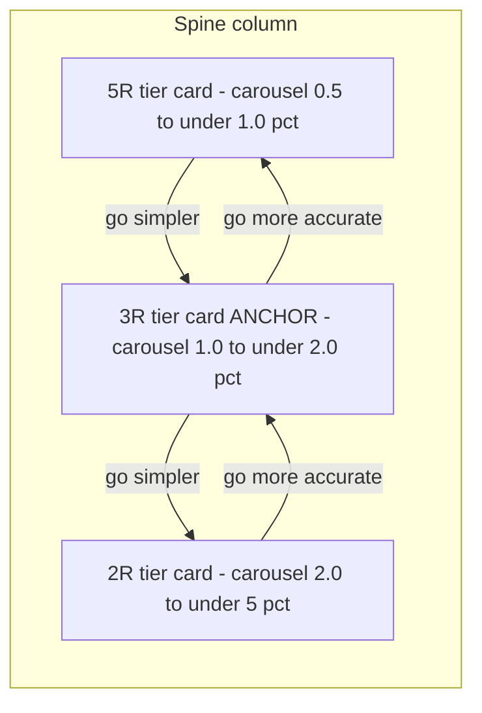

# Better Ranking

The current ranking is not useful. Sorting by accuracy produces a list with a random-looking spread of resistor counts, and sorting by resistor count produces a random-looking spread of accuracies. Neither ordering helps the user make the real decision they care about: *how much accuracy am I willing to give up to use fewer resistors?*

This story replaces the flat, single-axis sorted list (`accuracy` / `resistorCount` toggle) with a two-axis navigation model. The user starts at a **balanced** result and can move in two directions: **simpler** (fewer resistors, worse accuracy) or **more accurate** (more resistors, better accuracy). Within any given resistor count they can browse alternative configurations sideways.

> Status: proposal for discussion. Nothing here is implemented yet. See "Open questions", "Gaps & risks", and "Challenges to the rules" before starting a plan.

## Problem with the current behaviour

* `sortResults` orders the entire computed set by either `absError` then `count`, or `count` then `absError`.
* In "accuracy" mode the user scrolls through results whose resistor count jumps around unpredictably.
* In "resistor count" mode the user scrolls through results whose accuracy jumps around unpredictably.
* The user has no guided way to trade accuracy for simplicity, which is the decision that actually matters.

## Proposed model: a balanced anchor on a two-way spine

Think of every valid result (within ±5% of target and within the 5-resistor limit) as a point in a 2D space of `(resistorCount, absError)`. We navigate that space instead of flattening it into one list.

### Definitions

* **Valid result** — a network whose deviation is within ±5% of the target and uses at most 5 resistors (unchanged from story 3).
* **Complexity tier** — the set of valid results that share the same resistor `count` (e.g. "all 3-resistor results").
* **Tier best** — the lowest-`absError` result inside a complexity tier.
* **Spine** — the sequence of tiers that lie on the accuracy/complexity Pareto frontier: each step down uses fewer resistors *and* is the best accuracy achievable at that or any smaller count. Tiers not on the frontier are dropped (they offer no useful trade-off).
* **Anchor (balanced result)** — the tier on the spine chosen as the initial position: the "knee" of the accuracy-vs-complexity curve (point of diminishing returns). The user can move up (more accurate) or down (simpler) from here.
* **Similar results** — within one tier, the other configurations with the same `count`, ordered by `absError`, deduplicated and bounded (see rule 3).

### 1. The balanced anchor (rule 1, revised)

The best-accuracy result is almost always the *most complex* (5-resistor) network, which is a poor default to lead with. Instead, after pressing **Calculate**, present a **balanced** result and let the user navigate both ways:

* **Simpler** — move down the spine: fewer resistors, worse accuracy.
* **More accurate** — move up the spine: more resistors, better accuracy.

The balanced anchor is the **knee of the spine**: the tier where adding more resistors stops buying meaningful accuracy. Proposed algorithm: normalise the spine's `(count, error)` points to a unit square and pick the point with the greatest perpendicular distance below the straight line joining the two spine endpoints (a standard knee/elbow detection). If the spine has one or two tiers, the anchor is the more accurate endpoint.

> "Balanced" is subjective; the knee heuristic is a proposal. See open question 1.

### 2 & 4. The spine is the Pareto frontier (rules 2 and 4)

Moving **simpler** walks the **Pareto frontier** of `(count, absError)`. A tier is on the spine only if no other tier is *both* smaller in count *and* better in accuracy. A tier whose best accuracy is beaten by a smaller tier is **dominated** and dropped entirely — it brings no value (confirmed).

Building the spine, from most to fewest resistors:

1. Consider tiers in ascending order of resistor count.
2. Keep a tier only if its tier-best error is strictly lower than that of every smaller tier already kept — i.e. it is a new Pareto-optimal point.
3. Drop tiers whose best falls outside the ±5% tolerance.

Worked example (error budget ±5%):

| Resistor count | Tier-best error | On the spine? | Reason |
| --- | --- | --- | --- |
| 5 | 0.5% | ✅ | Lowest error overall (top of spine) |
| 4 | 1.5% | ❌ dropped | Dominated by the 3-resistor tier (fewer resistors *and* better accuracy) |
| 3 | 1.0% | ✅ | Best accuracy among tiers ≤ 3 resistors |
| 2 | 2.0% | ✅ | Best accuracy among tiers ≤ 2 resistors |
| 1 | > 5% | ❌ dropped | Outside the ±5% tolerance |

Resulting spine: **5R @ 0.5% ↔ 3R @ 1.0% ↔ 2R @ 2.0%**. The anchor (knee) is selected somewhere on this spine, and the user walks up or down from there.

### 3 & 4a. Similar results, bounded by the next simpler tier (rules 3, 4a, revised)

Within a tier the user can browse **similar** results: other configurations of the same resistor `count` (different connection topology and/or different resistor values), ordered by `absError`, deduplicated (rule 5).

The similar set is **bounded so it never becomes pointless**: a same-count alternative is only worth showing while it still beats the next simpler option. So for a tier at count `C` with the next-simpler spine tier best error `E_next`, the tier's similar results are those with `absError` in the range:

```
[ tierBest(C) , min(E_next, ±5% edge) )
```

* Once a `C`-resistor result is as bad as (or worse than) the simpler tier's best, the user should just take the simpler network, so we stop.
* The smallest tier on the spine has no simpler neighbour, so its bound is the ±5% edge only.
* This keeps each tier's carousel to genuinely competitive alternatives and, as a bonus, reduces how much search completeness matters (see risks).

Does this make sense? Yes — it gives "similar" a precise, self-justifying stop condition instead of an arbitrary cap.

### 5. Deduplication via canonical normal form (rule 5)

Two results are duplicates when they normalise to the same set of connections and the same values, e.g. `A + (B ∥ C)` is the same as `(C ∥ B) + A`. Duplicates must never both be shown.

Deduplication requires a **canonical normal form** for a network, not just the current description-string match:

* Flatten associative chains: `(A + B) + C`, `A + (B + C)` and `A + B + C` are one network; likewise for parallel `∥`.
* Sort operands of each series/parallel group by a stable key (value, then nested signature).
* Round values to a defined precision before comparing so floating-point noise does not create false distinct results.
* Two results with identical canonical forms are collapsed to one.

The existing `makeComposite` already sorts two children by `signature`, so the literal `A + (B ∥ C)` vs `(C ∥ B) + A` case may already collapse via the description string. The new requirement is a *general* normal form that also handles associativity and 3+ operand groups, which the current code does not.

## Navigation state and UI (rules 5 and 5a)

The results area becomes a **vertical column of tier cards**, one card per spine tier. Instead of a flat list with "Show 3 more", the user reveals adjacent tiers as they navigate:

* Initially only the **anchor** tier card is shown (chosen by rule 1).
* **Go more accurate** reveals the next spine tier *above* the current one (more resistors, better accuracy).
* **Go simpler** reveals the next spine tier *below* the current one (fewer resistors, worse accuracy).
* Revealed cards stay on screen, so the column grows into a visible ladder of trade-offs (most accurate at the top, simplest at the bottom).
* When there is no tier above (top of spine) or below (bottom of spine), the corresponding action is disabled.

Each tier card is a **carousel over that tier's similar results** (rule 5a):

* The card shows one configuration at a time, starting at the tier best (lowest error).
* **Right arrow** → next *not-better* result (higher `absError`) within the tier's bounded similar set.
* **Left arrow** → previous *non-worse* result (lower `absError`).
* Arrows are disabled at the ends of the bounded similar set.
* A position indicator (e.g. `2 / 5`) shows where the user is within the tier.

The `accuracy` / `resistorCount` ranking toggle from story 3 is removed; ordering is now defined by the spine (vertical) and the per-tier carousel (horizontal).



## Behaviour requirements (draft)

* On **Calculate**, compute the full valid result set once (as today), deduplicate by canonical normal form, then build tiers and the spine.
* Compute the spine as the Pareto frontier over `(count, tier-best error)`; drop dominated tiers entirely.
* Choose the anchor tier as the knee of the spine; render only the anchor card initially.
* For each tier, precompute its bounded, ascending-error similar set: `[tierBest, min(nextSimplerTierBest, ±5% edge))`.
* **Go more accurate** / **Go simpler** reveal the adjacent spine tier card and keep previously revealed cards visible.
* Each tier card is a carousel: right = next higher-error result, left = next lower-error result, within the tier's bounded similar set.
* Recompute everything on the next **Calculate**; changing inputs without pressing Calculate does not change what is shown (unchanged from story 3).
* Keep logging total found results and computation time to the console (unchanged from story 3).
* If there are no valid results, show the existing empty-state message.

## Open questions (need clarification)

1. **Definition of "balanced".** Is the knee/elbow heuristic the right default anchor, or would you prefer a simpler rule (e.g. the middle tier of the spine by count, or the simplest tier within a fixed budget such as 1%)? The knee is principled but can feel arbitrary on short spines.
2. **Similar bound edge behaviour.** When a tier's `tierBest` equals the next simpler tier's best (rare tie), the bounded similar set is empty except the tier best. Confirm that's acceptable (the card still shows the single best config).
3. **Similar ordering tie-breaks.** Within the bounded set, order strictly by `absError`. Secondary tie-break — fewer distinct resistor values? preference for series over parallel? closeness to nominal E-series values? Or leave ties arbitrary?
4. **Tolerance semantics.** Is the ±5% budget a symmetric window on deviation, or should over-target vs under-target be treated differently?
5. **Same value, different topology.** Are two same-count results with the same resistance value but genuinely different topologies (e.g. `100 ∥ 100 = 50` vs another network equal to 50) duplicates, or distinct "different configurations"? Rule 5 as written treats only normalisable-equal networks as duplicates, so these stay distinct.
6. **Reveal vs replace.** Confirmed model is "reveal and keep" (the column grows). Should there be a reset/collapse control to return to just the anchor without re-running Calculate?

## Gaps & risks

* **Search completeness — deferred (decision).** `findAllResistorNetworks` prunes each expansion layer (`pruneExpansionLayer`: ≤4 per ~2% value bucket, ≤256 per layer), so the computed set is not exhaustive.
  * *Impact on this story:* pruning sorts by closeness to target, so the tier-best per count (and therefore the anchor and spine) is very likely preserved. The main thing at risk is *diversity* of same-count alternatives and some high-count combinations built from pruned intermediates.
  * *Why deferral is safe:* the ranking logic is agnostic to how complete the set is, and rule 3's bound restricts "similar" to a narrow error band, so we need less diversity than a full ±5% list would.
  * *Decision:* build ranking on the current (pruned) result set now; treat completeness as a separate follow-up. A later measurement (exhaustive vs pruned) can quantify the actual miss rate if needed.
* **Canonical form cost.** A correct normal form (flatten + sort + rounded value compare) adds work and must be well-tested; getting it wrong either hides real alternatives (over-dedup) or shows duplicates (under-dedup).
* **Short-spine edge cases.** Spine of length 1 → anchor is the only card, both navigation actions disabled. Spine of length 2 → anchor is the more accurate endpoint. The UI must handle these gracefully.
* **Floating-point rounding** in value comparison interacts with dedup, tier-best selection, and the similar bound; a single precision constant should govern all of them.
* **Migration.** Story 3's tests (`resultRanking.test.ts`, `ResultsList` behaviour, the more-results e2e specs, the ranking toggle) assume the flat list + toggle model and will be rewritten, not extended.

## Challenges to the rules

* **Challenge to the knee anchor.** On spines with only two or three tiers the knee is barely meaningful; a fixed rule ("simplest tier within 2%") may feel more predictable to users. Worth deciding before implementing.
* **Challenge to dropping dominated tiers.** Dropping e.g. all 4-resistor results is clean, but a user who physically owns four resistors loses those options. Accepted for now (rule 2), but note it as a possible future "advanced view".
* **Challenge to "similar = same count".** Two same-count results with very different value spreads (e.g. `1M + 10` vs `500k + 500k`) are both "similar" by count yet very different to build. A buildability/cost heuristic in the tie-break (open question 3) may be more useful than pure error ordering.

## QA notes

* Unit tests for spine construction (Pareto frontier), including the worked example (5 → drop 4 → 3 → 2 → drop 1).
* Unit tests for the knee/anchor selection, including length-1 and length-2 spines.
* Unit tests for the bounded similar set: range `[tierBest, min(nextSimplerBest, ±5% edge))`, and the smallest-tier fallback to the ±5% edge.
* Unit tests for canonical normal form: `A + (B ∥ C)` == `(C ∥ B) + A`, associativity flattening, and rounded-value equality.
* Component tests for the tier column: reveal-above / reveal-below, disabled actions at the spine ends, reset on Calculate.
* Component tests for the per-tier carousel: right = next worse, left = next better, disabled at the ends, position indicator.
* e2e tests: Calculate → see balanced anchor → go simpler/more accurate reveals adjacent tiers skipping dominated ones → carousel browses configs within a tier → duplicates never appear.
